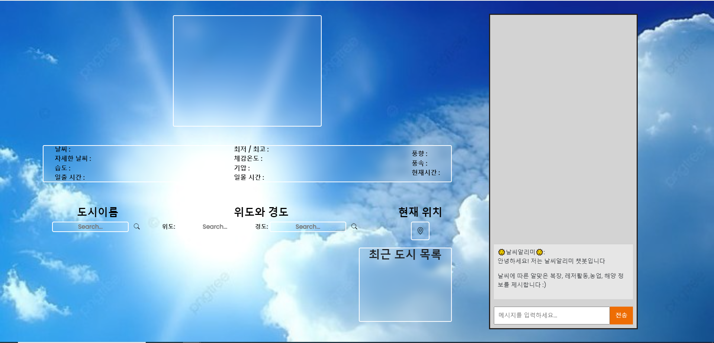
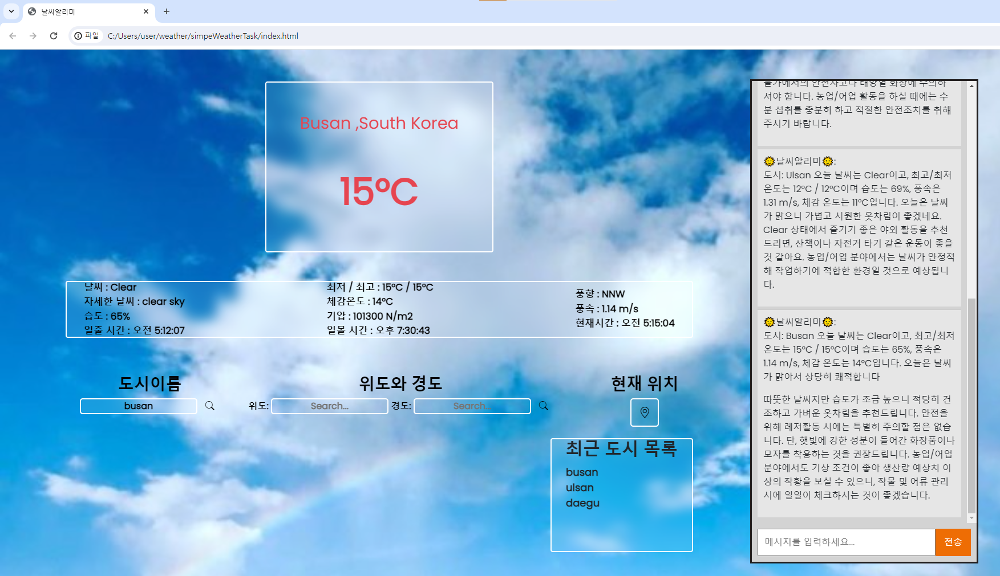

# GPT 기반 날씨알리미
날씨 알리미는 사용자가 요청한 위치의 실시간 날씨 정보를 제공하며 GPT를 활용하여 대화 형식으로 정보를 전달합니다. 
사용자는 GPT가 기온에 맞는 옷차림과 농업/해양/레저 활동 정보를 추천받을 수 있습니다.

# 프로젝트 소개
GPT 기반 날씨알리미는 kimjhhhhhhhhhhhhhh과 tkdgur7234 2인이 기획하고 개발한 2024 오픈소스 소프트웨어 팀 프로젝트입니다.

# 구현된 기능
- 실시간 일몰, 일출시간 제공
- UI 디자인을 통한 가독성 향상
- 현재 날씨에 맞는 맞춤형 옷차림 추천
- 농업/해양/레저 활동 정보 제공
- 최근 검색기록 기능

# 추가 예정 기능
- 주간 및 월간 날씨 예보
- 다국어 지원 (영어 가능)

## Authors
  - [tkdgur7234r](https://github.com/tkdgur7234) - **박상혁** - <tkdgur7234@kakao.com>
    날씨알리미 메인개발
  - [kimjhhhhhhhhhhhhhh](https://github.com/kimjhhhhhhhhhhhhhh) - **김정현** - <wjdgus08590@naver.com>
    날씨알리미 UI디자인 및 개발
  

# 배포
- [날씨알리미](https://weather-task-zeta.vercel.app/)

# 결과물
OpenWeatherMap API와 GPT를 활용하여 웹페이지를 구현하고 다양한 기능을 제공하는 결과물입니다.




## License

```
MIT License

Copyright (c) 2024  kimjhhhhhhhhhhhhhh, tkdgur7234

Permission is hereby granted, free of charge, to any person obtaining a copy
of this software and associated documentation files (the "Software"), to deal
in the Software without restriction, including without limitation the rights
to use, copy, modify, merge, publish, distribute, sublicense, and/or sell
copies of the Software, and to permit persons to whom the Software is
furnished to do so, subject to the following conditions:

The above copyright notice and this permission notice shall be included in all
copies or substantial portions of the Software.

THE SOFTWARE IS PROVIDED "AS IS", WITHOUT WARRANTY OF ANY KIND, EXPRESS OR
IMPLIED, INCLUDING BUT NOT LIMITED TO THE WARRANTIES OF MERCHANTABILITY,
FITNESS FOR A PARTICULAR PURPOSE AND NONINFRINGEMENT. IN NO EVENT SHALL THE
AUTHORS OR COPYRIGHT HOLDERS BE LIABLE FOR ANY CLAIM, DAMAGES OR OTHER
LIABILITY, WHETHER IN AN ACTION OF CONTRACT, TORT OR OTHERWISE, ARISING FROM,
OUT OF OR IN CONNECTION WITH THE SOFTWARE OR THE USE OR OTHER DEALINGS IN THE
SOFTWARE.
```